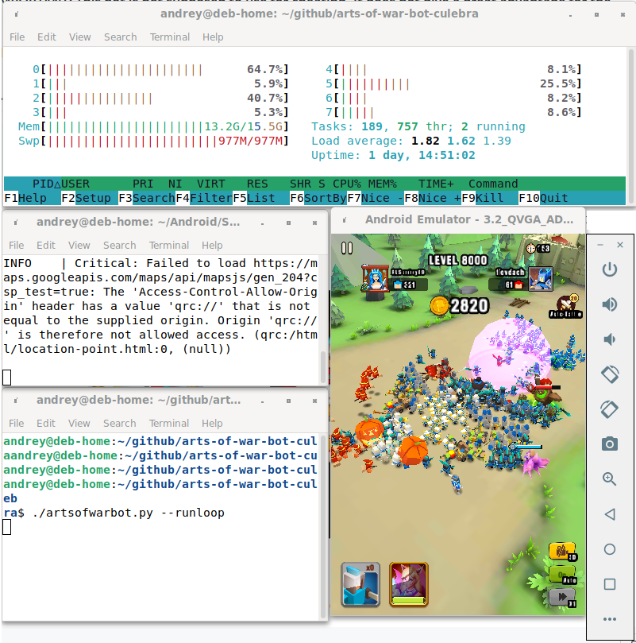

# Art Of Wars game bot

This bot demonstrates how you can use the [Culebra](https://github.com/dtmilano/AndroidViewClient) to emulate user actions.



## Features

- Pure python with simple installation and usage.

- Support timed scenarios.

- Tested on the official Android Emulator under Debian 11.

- Include Action buttons for resolution 320x480 EN.

- Unit tests for screen snapshot checking.

## Usage

```
git clone https://github.com/andreytmk/arts-of-war-bot-culebra.git
cd arts-of-war-bot-culebra
pip install -r requirements.txt
chmod a+x artsofwarbot.py
./artsofwarbot.py --runloop
```

## Testing

```
pytest
```
